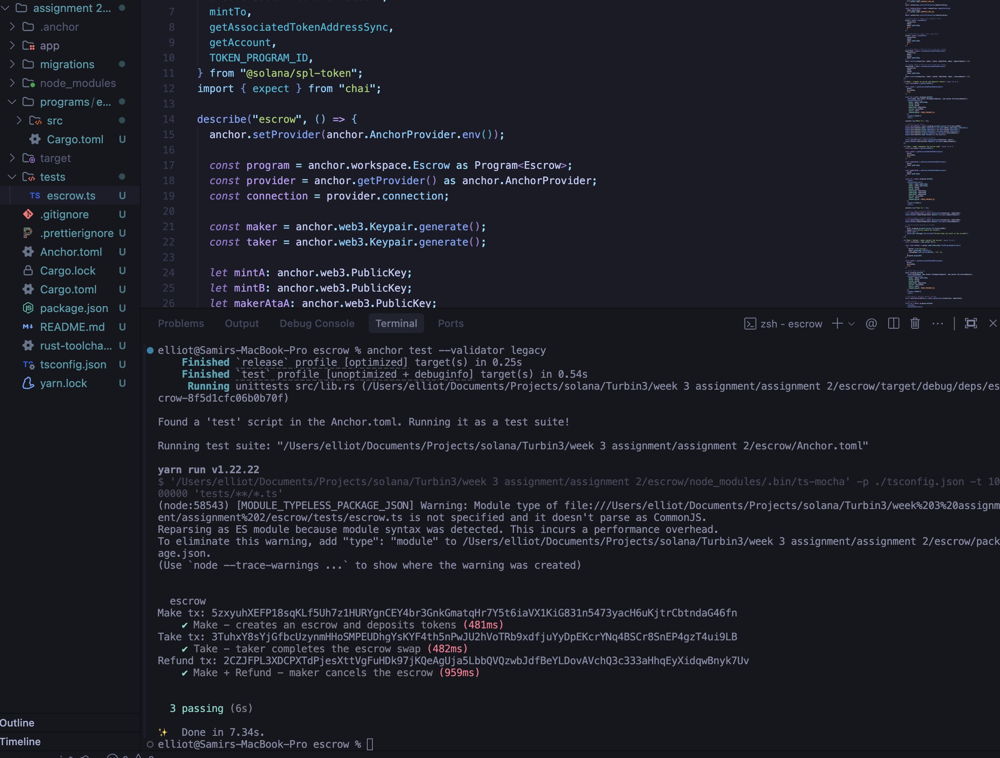
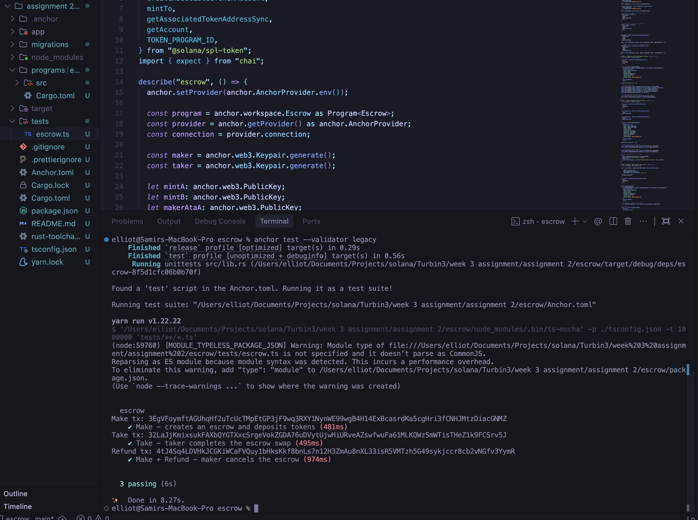

# Anchor Escrow Program (Turbin3 Assignment 2)

A Solana smart contract built with the Anchor framework that implements a trustless token escrow service. Two parties can securely swap SPL tokens without relying on a centralized intermediary. This is a complete implementation for Turbin3 Week 3 Assignment 2.

## Features

- **Make**: A maker creates an escrow by depositing Token A into a PDA-controlled vault, specifying how much Token B they want in return.
- **Take**: A taker fulfills the escrow by sending the requested Token B to the maker and receiving Token A from the vault.
- **Refund**: The maker can cancel an unfulfilled escrow at any time, reclaiming their deposited Token A from the vault.

## Technical Stack
- **Framework**: Anchor 1.0.2
- **Solana**: 3.1.x Toolchain & Platform-Tools
- **Language**: Rust
- **Token Standard**: SPL Token Interface (Token-2022 compatible)
- **Tests**: TypeScript (Mocha + Chai)

## How It Works

1. **Maker** calls `make()` with a seed, deposit amount, and desired receive amount.
   - An `Escrow` PDA is created storing the terms of the swap.
   - Token A is transferred from the maker's ATA into a vault ATA owned by the escrow PDA.

2. **Taker** calls `take()` to complete the swap.
   - Token B is transferred from the taker to the maker.
   - Token A is transferred from the vault to the taker.
   - The vault and escrow accounts are closed.

3. **Refund** — If no taker appears, the maker can call `refund()`.
   - Token A is returned from the vault to the maker.
   - The vault and escrow accounts are closed.

## Local Development

### Prerequisites
- Solana CLI v3.1.x+
- Anchor CLI 1.0.x+
- Node.js & Yarn

### Setup & Testing
1. Install node dependencies:
```bash
yarn install
```

2. Build the program:
```bash
anchor build
```

3. Sync the generated Program ID:
```bash
anchor keys sync
```

4. Run the integration tests:
```bash
anchor test --validator legacy
```

## Structure
- `programs/escrow/src/lib.rs` - The core escrow smart contract with Make, Take, and Refund instructions.
- `tests/escrow.ts` - Comprehensive integration test suite validating all three instructions with full SPL token setup.

## Test Results



<br>


